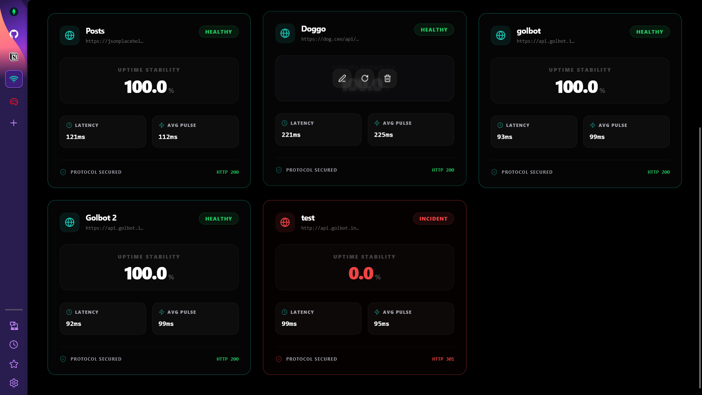
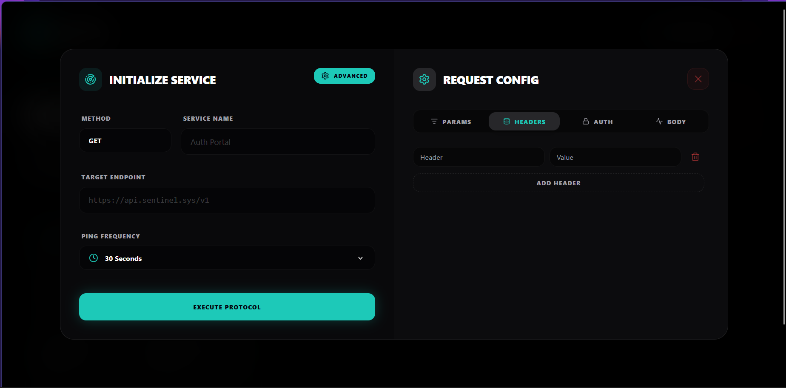

# 🛡️ SENTINEL | Real-Time API Fleet Monitor


Sentinel is a high-performance, mission-critical API monitoring platform designed for real-time fleet surveillance. It provides DevOps teams and SREs with a premium "Mission Control" interface to track the health, latency, and uptime of distributed microservices.

---

## 📸 Interface Preview

<p align="center">
  
  
</p>
<p align="center">
  
  
</p>
<p align="center">
  
  
</p>

---

## 🚀 Project Philosophy & Use Case

In modern microservice architectures, API reliability is paramount. **Sentinel** was built to bridge the gap between simple "ping" scripts and complex, expensive enterprise monitoring suites.

### Core Use Cases:
*   **Fleet Management**: Organize services into **Workspaces (Folders)** to isolate environments (e.g., Production vs. Staging) and filter fleet states.
*   **Incident Deep-Dive**: Use the **Intelligence Modal** to parse response payloads (JSON/Images) and identify the root cause of failures.
*   **High-Density Surveillance**: Track massive API fleets with a compact, grid-optimized "Mission Control" interface.
*   **Uptime Stability Tracking**: Calculate long-term reliability scores based on the last 100 surveillance pulses.

---

## 🛠️ Tech Stack & Architecture

### 🌌 Backend (Spring Boot Infrastructure)
The backend is a robust Java-based engine built on **Spring Boot 3**, leveraging a multi-threaded polling architecture.
*   **Polling Engine (`ApiMonitor.java`)**: A specialized component utilizing `TaskScheduler` to manage independent threads for every registered service.
*   **Organizational Tier**: Implements a **Workspace System** (MongoDB collection) allowing users to group API telemetry into persistent folders.
*   **Security Context**: Stateless JWT authentication with a custom `JwtTokenFilter` and BCrypt password encryption.
*   **Persistence**: MongoDB Atlas integration using `Spring Data MongoDB` for time-series ping logging and fleet metadata.

### 🌓 Frontend (React Operations)
A premium "Dark Veil" aesthetic built for high-density information display.
*   **Mission Control Dashboard**: A responsive grid-based UI utilizing **Framer Motion** for status-driven animations and workspace navigation.
*   **State Management**: **Redux Toolkit** handles the global fleet and workspace state, ensuring real-time UI updates across organizational folders.
*   **Intelligence Extraction**: A specialized React component that detects image URLs and structured JSON within raw API responses.

---

## 📂 Project Structure

```text
Sentinel/
├── backend/                # Spring Boot 3 + MongoDB Atlas
│   ├── src/main/java/      # Core logic
│   │   ├── controllers/    # API Endpoints (Services, Workspaces, Auth)
│   │   ├── models/         # MongoDB Documents (User, Service, Workspace, PingLog)
│   │   ├── repositories/   # Data Access (Spring Data Mongo)
│   │   └── engine/         # ApiMonitor (Surveillance Heart)
│   └── src/main/resources/ # Configuration
├── frontend/               # React 18 + Vite + Redux
│   ├── src/components/     # Modular UI (WorkspaceCards, ServiceGrid)
│   ├── src/pages/          # Main Views (Dashboard, Auth, Home)
│   ├── src/store/          # Redux Slices (fleetSlice, authSlice)
│   └── src/hooks/          # Custom Hooks (usePolling)
└── README.md
```

---

## ⚡ Setup & Initialization

### 1. Prerequisites
- **Java 17+** Installed
- **Node.js 18+** Installed
- **MongoDB Atlas** Account

### 2. Backend Configuration
Create a `.env` file in the `backend/` directory:
```env
PORT=5500
MONGO_URI=your_mongodb_atlas_connection_string
JWT_SECRET=your_secure_random_key
```

**Launch Backend:**
```powershell
cd backend
./mvnw spring-boot:run
```

### 3. Frontend Configuration
```powershell
cd frontend
npm install
npm run dev
```

---

## 🛰️ Core System Features

### 📁 Workspace Organization (Folders)
The platform now supports an organizational tier called **Workspaces**. Users can establish custom folders (e.g., "Payments API", "User Microservices") to isolate specific sets of services. The dashboard dynamically filters telemetry based on the active folder, providing a clean, environment-specific monitoring experience.

### 📡 Surveillance Engine & Protocols
The engine supports complex HTTP configurations including:
*   **Custom Methods**: GET, POST, PUT, DELETE, PATCH.
*   **Header Injection**: Dynamic header configuration for API testing.
*   **Stateless Auth**: Support for Bearer Token injection in surveillance pulses.
*   **Payload Support**: JSON body submission for state-changing endpoints.

### 🧠 Intelligence Modal
A tabbed analysis tool that separates **Raw Data** from **Intelligence Data**. It uses smart extraction to render images from APIs or clean lists of content, providing instant visual feedback on API health.

### 🛡️ Secure Auth Portal
Stateless JWT authentication ensures that only authorized operators can modify the surveillance fleet. The system supports browser-native password management and persistent sessions.

---

*Sentinel | Real-Time Fleet Monitor & Incident Tracker | 2026*
