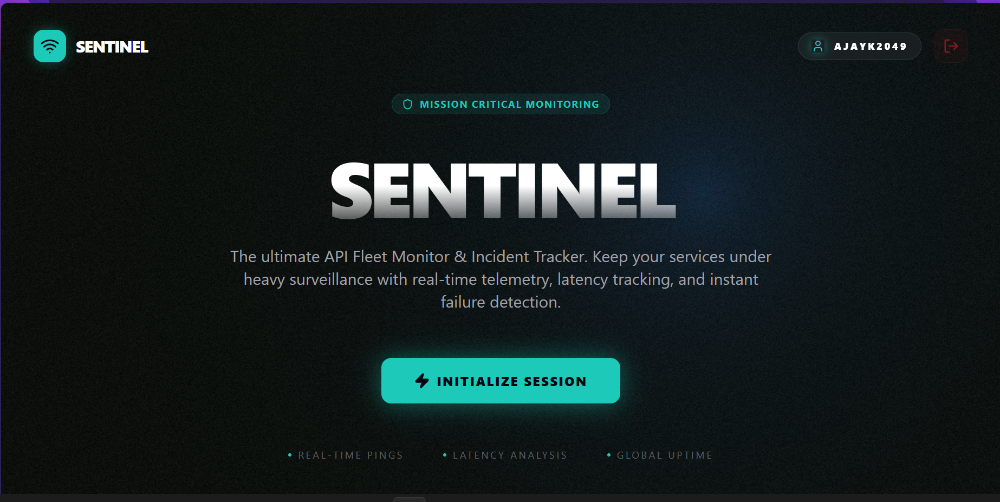
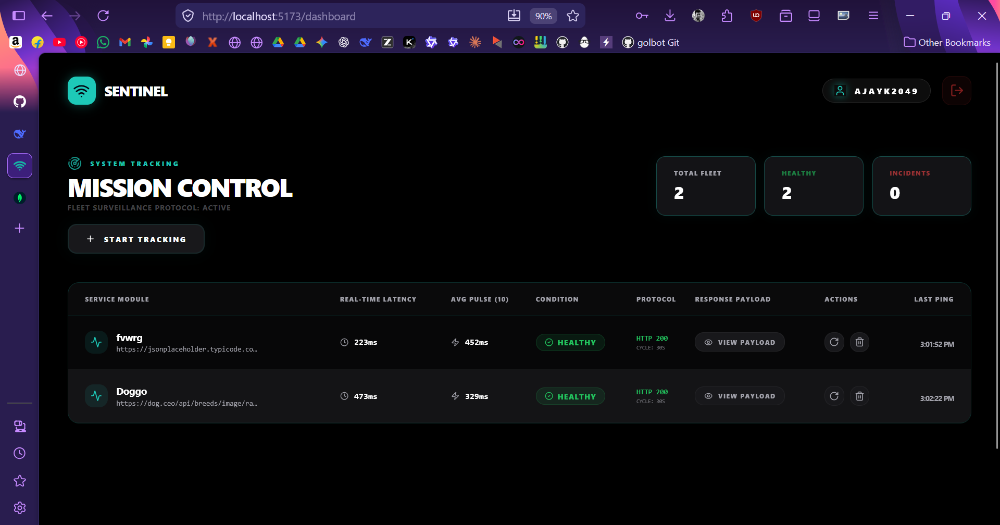
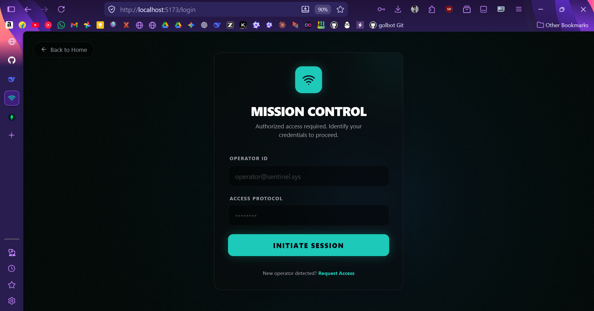
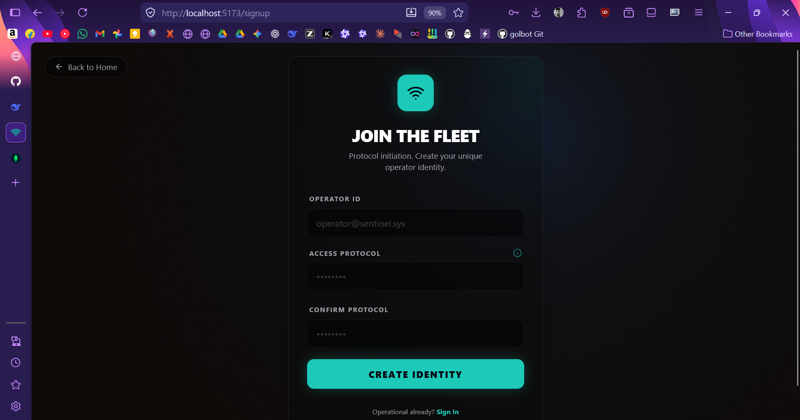

# 🛡️ SENTINEL | Real-Time API Fleet Monitor


Sentinel is a high-performance, mission-critical API monitoring platform designed for real-time fleet surveillance. It pings external endpoints at scheduled intervals, logs telemetry data (latency, status codes, uptime), and serves this data to a premium, WebGL-enhanced dashboard.

---

## 📸 Interface Preview

<p align="center">
  
  
</p>
<p align="center">
  
  
</p>

---

## 🛠️ Tech Stack

### Backend Infrastructure


### Frontend Operations


#### 🎨 Design & Animation


#### 🧩 Shadcn UI & Utilities


#### 🔡 Typography


---

## 📈 Technical Specifications

### Telemetry & Logging
The system maintains a dual-layer logging strategy:
- **System Logs**: Located in `backend/logs/`, tracking all Spring Boot internal operations.
- **Incident Logs**: Stored in MongoDB, providing historical data for every registered API endpoint, accessible via the dashboard's telemetry view.

---

## 📂 Project Structure

```text
Santinel/
├── backend/                # Spring Boot 3 + MongoDB Atlas
│   ├── src/main/java/      # Core logic (Polling Engine, Auth, Controllers)
│   ├── src/main/resources/ # Configuration & Logback setup
│   ├── logs/               # Persistent system logs
│   └── .env                # Backend environment secrets
├── frontend/               # React 18 + Vite + Redux
│   ├── src/components/     # UI Components (DarkVeil, Navbar, etc.)
│   ├── src/pages/          # Main Views (Home, Auth, Dashboard)
│   ├── src/store/          # Redux State Management
│   └── public/             # Static assets (Favicons, etc.)
├── progress.md             # Mandatory activity logging (Internal)
└── README.md               # Master Project Documentation
```

---

## ⚡ Setup & Initialization

### 1. Prerequisites
- **Java 17+** Installed
- **Node.js 18+** Installed
- **MongoDB Atlas** Account (for cloud persistence)

### 2. Backend Configuration
Create a `.env` file in the `backend/` directory:
```env
PORT=5500
MONGO_URI=your_mongodb_atlas_connection_string
JWT_SECRET=your_secure_random_key (or leave empty for auto-gen)
```

**Launch Terminal:**
```powershell
cd backend
./mvnw spring-boot:run
```

### 3. Frontend Configuration
Install dependencies and initiate the development server:
```powershell
cd frontend
npm install
npm run dev
```

---

## 🛰️ Core Systems

### Polling Engine
The backend utilizes a multi-threaded `@Scheduled` engine to ping registered API endpoints every 60 seconds. It records:
- **Latency**: Precise response time in milliseconds.
- **Status Codes**: 2xx (Success), 4xx/5xx (Incidents).
- **History**: Time-series data for incident tracking.

### Auth Portal
- **JWT-Based**: Secure stateless authentication.
- **Google Protocol**: Frontend supports browser-native strong password suggestions during signup.
- **Dynamic Identity**: Navbar extracts and displays operator handles from session tokens.

---

*Sentinel | Real-Time Fleet Monitor & Incident Tracker | 2026*
